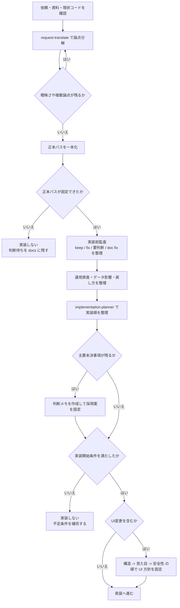

# Project Rules

- 対象アプリ本体は着手前に一本化して確定する。
- 現在の候補は `E:\自作アプリ集\workspace\projects\post-manager-remake\app` と `E:\自作アプリ集\post_manager-fix-browser-close-issue_backup_20260323_025001`。
- 読む先、実装先、文書更新先は同じパスに揃える。
- このフォルダは実装計画と判断記録の保管場所であり、アプリ本体の正本コードは含まない。
- 実装前に計画が固まったら、要点を `docs/` に同期する。
- keep/fix の判断、運用資産の扱い、戻し方は本体側 docs と矛盾させない。
- `browser_profile/`、`data/posts.csv`、`config/*` を壊す変更は、計画上でも危険操作として明示する。
- UI改善は「構造 -> 見た目 -> 安全性」の順を守る。
- Pixiv / Patreon は入力補助まで、最終投稿は人手確認前提を崩さない。

## 実装前フロー

エージェントは実装に入る前に、次の順で進める。

## 実装開始条件

- 正本パスが固定されている
- keep / fix / 要判断 / doc fix が整理されている
- `data/posts.csv`、`config/*`、`browser_profile/` の保護方針がある
- 戻し方がある
- 初回実装スコープ外が明示されている
- UI変更がある場合は、構造方針が先に決まっている

## 長期化防止ルール

- 実装前監査は「実装のための判断固定」が目的であり、網羅調査そのものを目的化しない。
- 正本パス、主要未決事項、運用資産保護、戻し方が揃ったら、追加調査より先に判断メモを作る。
- 主要未決事項が 3 個以下になったら、無期限に探索を続けず、採用案を文書化して前進する。
- 「未確認」が残っていても、初回実装の安全性に直結しないものは第2段階候補へ送る。
- 実装停止条件は「正本パス未固定」「運用資産破壊リスク未整理」「戻し方不在」のいずれかが残る場合に限定する。
- それ以外は、最小安全スコープを切って実装準備完了へ進める。

## 実装前文書

- 実装前の採用案は `docs/pre-implementation-decision-memo_20260327.md` を参照する。
- 実装前の handoff は `docs/rebuild-thread-handoff.md` を参照する。
