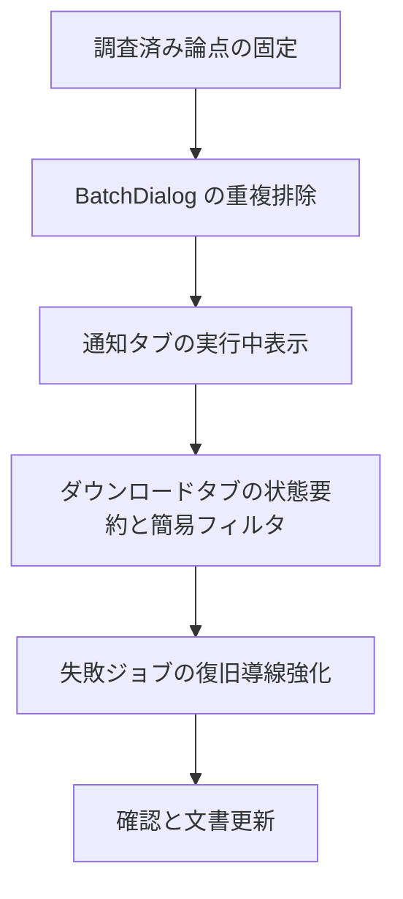

# 実装計画 2026-04-07 利便性改善 Phase 3

## 1. 依頼の要点

- 目的:
  - fix 版を「直った試作」から「日常的に使いやすいアプリ」へ近づける
- 対象 project:
  - `E:/codex/workspace/projects/civitai-downloader-fix`
- 変更したいこと:
  - キュー運用、一括追加、通知確認、失敗復旧の便利さを上げる
- 変えないこと:
  - 4 タブ構成
  - 手動開始ベースの基本運用
  - 既存 DB スキーマの大幅変更
  - ブラウズ UI の全面改修

## 2. 現状確認

- 対象画面:
  - `ダウンロード` タブ
  - `一括追加` ダイアログ
  - `通知` タブ
  - `設定` タブ
- 関連処理:
  - `DownloadManager` による状態遷移
  - `UpdateChecker` による通知生成
  - `BatchSearchWorker` による API 検索
- 関連データ / 設定:
  - `download_jobs`
  - `notifications`
  - `folder_presets`
  - `settings`
- 正本:
  - `E:/codex/workspace/projects/civitai-downloader-fix/civitai_downloader`
- 現時点で分かっている制約:
  - 既存の手動開始フローは残す必要がある
  - UI の主戦場はブラウズより運用系タブ
  - 右クリック依存は減らしたいが、既存導線はすぐ消さない

## 3. 論点分解

- UI の論点:
  - 主操作が散っている
  - 進行中か無反応かが分かりにくい箇所がある
  - 一覧画面で判断材料が不足している
- データ / 設定の論点:
  - 同一モデル重複の扱いが未整理
  - 完了ジョブを残す前提のまま件数が増えると見通しが悪い
- 外部 I/O の論点:
  - 通知手動チェックは通信中フィードバックが弱い
  - 一括追加は API 検索結果の重複やページ跨ぎが運用ノイズになる
- 互換性の論点:
  - 既存の `download_jobs` と `notifications` の扱いは維持したい
  - 既存ボタン名やタブ名は大きく変えない方が安全
- 運用上の論点:
  - 失敗理由から次の行動へ繋がっていない
  - ジョブ件数が増えた時の捌き方が弱い

## 4. 実装フロー

## 5. 最小実装単位

### Step 1
- 目的:
  - `BatchDialog` の重複排除と選択件数の即時追従を入れる
- 触る場所:
  - `civitai_downloader/ui/batch_dialog.py`
  - 必要なら `civitai_downloader/core/batch_search_worker.py`
- この段階で確認すること:
  - 同一 `model_id` がページ収集と API 検索で重複表示されない
  - チェック操作ごとに件数表示が更新される
  - `全選択 / 全解除 / 次のページ` でも件数が破綻しない
- 戻し方:
  - `BatchDialog` の重複管理ロジックだけを差し戻せばよい
- この順でやる理由:
  - 利便性への効果が高く、他画面への依存が薄い

### Step 2
- 目的:
  - `通知` タブの手動チェックに実行中表示を追加する
- 触る場所:
  - `civitai_downloader/ui/notification_tab.py`
  - 必要なら `civitai_downloader/core/update_checker.py`
- この段階で確認すること:
  - 実行中は二重実行できない
  - 実行開始、進捗、完了、前回確認時刻が分かる
  - 通信失敗時も次の行動が分かる
- 戻し方:
  - UI 側の表示強化を外せば、既存の手動チェック機構へ戻せる
- この順でやる理由:
  - 既存構造を崩さず安全に改善できる

### Step 3
- 目的:
  - `ダウンロード` タブ上部へ状態要約と簡易フィルタを追加する
- 触る場所:
  - `civitai_downloader/ui/download_tab.py`
  - 必要なら `civitai_downloader/db/repository.py`
- この段階で確認すること:
  - `開始可能 / 失敗 / 未解決 / 進行中` の要約が現在値に追従する
  - 状態フィルタで一覧が絞り込める
  - 既存の選択、開始、保存先変更、右クリック導線を壊していない
- 戻し方:
  - 要約表示とフィルタ UI を外し、テーブル全件表示に戻す
- この順でやる理由:
  - 一覧運用の分かりやすさを大きく上げるが、前段の独立改善より影響が広い

### Step 4
- 目的:
  - 失敗ジョブの復旧導線を強化する
- 触る場所:
  - `civitai_downloader/ui/download_tab.py`
  - `civitai_downloader/core/download_manager.py`
  - 必要なら `civitai_downloader/db/repository.py`
- この段階で確認すること:
  - 失敗理由の分類に応じて `再試行 / モデルページを開く / 保存先修正 / 設定案内 / ログ案内` が辿れる
  - 誤って危険操作へ誘導しない
  - 既存の `retry_job()` と競合しない
- 戻し方:
  - 詳細導線を外して、従来の失敗表示と右クリック操作に戻す
- この順でやる理由:
  - UI 要約やフィルタが先にある方が、失敗導線の見せ方を整理しやすい

## 6. 確認計画

- 正常系:
  - 一括追加で重複なくキュー投入できる
  - 通知手動チェックが実行中表示付きで完了する
  - 状態要約がジョブ状態に追従する
  - 失敗ジョブから次アクションへ進める
- 失敗系:
  - 通知手動チェックの通信失敗
  - `failed` ジョブの分類不能メッセージ
  - フィルタ中にジョブ状態が変わるケース
- 空入力:
  - 一括追加の検索条件空
  - 通知タブで追跡モデルが 0 件
- 不正設定:
  - API キー不正
  - 保存先プリセット無効
- 存在しないパス:
  - 失敗導線から保存先修正が必要なケース
- 途中停止 / キャンセル:
  - 通知手動チェック中の画面遷移
  - フィルタ切替中の選択解除
- 危険操作:
  - 失敗ジョブ削除や再試行の誤操作
  - 複数選択時の一括開始との競合
- メモリ / GPU / 長時間処理:
  - 今回は主に UI 変更のため増分確認のみ
  - 通知チェックの無限待機や重複実行は確認対象に含める

## 7. 未決事項

- 実装前に決めること:
  - 同一 `model/version` の重複キューを `禁止 / 警告 / 許可` のどれにするか
  - 完了ジョブを既定表示のままにするか、将来 `完了を隠す` を既定へ寄せるか
- 実装しながら決めてよいこと:
  - 状態要約の表示文言
  - フィルタの UI 形式
  - 失敗詳細の表示形式
- ユーザー確認が必要な分岐:
  - 重複キューの扱いを強制変更する場合
  - 完了ジョブの既定表示方針を変える場合

## 8. 完了条件

- この案件で完了と見なす条件:
  - `BatchDialog` の重複と件数表示が破綻しない
  - 通知タブで手動チェックの実行状態が分かる
  - ダウンロードタブで現状把握しやすくなる
  - 失敗ジョブから次の行動へ進める
  - 既存の開始、保存先変更、削除確認、通知既読導線を壊していない
- 今回やらないこと:
  - タブ構成の全面見直し
  - ブラウズ UI の大改修
  - 自動仕分けや高度な自動運用
- 残るリスクの扱い:
  - 仕様未決の重複キュー方針は実装前に固定する
  - GUI 実操作の体感差は、オフスクリーン確認とは別に手動確認へ残す
