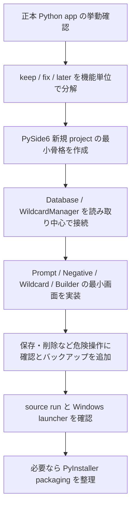

# デスクトップアプリ化方針

## 1. 要求の整理

- 依頼の本質: 画像生成プロンプト管理は文字列、タグ、ワイルドカード、SQLite、ローカルファイルを主に扱うため、ブラウザ前提の Web アプリより、ローカルデスクトップアプリの方が自然ではないかという再検討。
- 現行正本: `E:\自作アプリ集\新しいフォルダー (2)` の Python + customtkinter アプリ。
- 現行入口: `main.py` と `起動.bat`。
- 現行資産: SQLite `data\prompts.db`、`data\wildcards`、`Database`、`WildcardManager`、Prompt / Wildcard / Builder の各 tab。
- 影響: React 版 `image-prompt-studio` を本実装の正本にする前提を見直す。正本 Python app への直接破壊的変更は避け、別フォルダで再構築するのが安全。

## 2. 候補アプローチ

### 候補A: 正本 Python app を customtkinter のまま整理する

- 概要: 現行 `E:\自作アプリ集\新しいフォルダー (2)` の構成を保ち、UI と起動、保存、ワイルドカード管理を段階的に改善する。
- 強み: 既存 DB と wildcard 処理をそのまま使いやすい。実装量が少ない。
- 弱み: デザイン性と複雑な UI レイアウトには限界が出やすい。既存 UI の歪みを引きずりやすい。
- 適合度: 中。短期修理には良いが、見た目と使いやすさを上げる本命としては弱い。

### 候補B: Python core を残し、PySide6 / Qt でデスクトップ UI を再構築する

- 概要: `Database` と `WildcardManager` の考え方を core として残し、UI を PySide6 で作り直す。
- 強み: ローカルファイル、SQLite、クリップボード、ウィンドウ、ショートカットとの相性が良い。テキスト中心の業務 UI を作りやすい。Web サーバーやブラウザ起動が不要。
- 弱み: React 試作の UI はそのまま使えない。Qt の画面設計を新しく作る必要がある。
- 適合度: 高。今回の「文字を主に扱うデスクトップツール」として最も自然。

### 候補C: React 版を Electron / Tauri でデスクトップ化する

- 概要: 現 React app を desktop shell で包み、必要に応じて Python 正本と連携する。
- 強み: 既存 React UI を活かせる。見た目は作りやすい。
- 弱み: 文字列とローカル DB 中心の小型ツールには構成が重い。Python core と二重管理になりやすい。配布や起動の複雑さが増える。
- 適合度: 低から中。Web UI を強く活かしたい理由がない限り、本命にしない。

## 3. 推奨案

- 推奨構成: 候補B。Python core を正本として残し、PySide6 / Qt の Windows デスクトップアプリとして再構築する。
- 推奨理由: このアプリの主対象はプロンプト文字列、タグ検索、ワイルドカード、SQLite、クリップボードであり、Web アプリの利点である配信、共有、URL、マルチデバイス性が主目的ではない。ローカルファイル操作とデスクトップ操作を自然に扱える Python デスクトップの方が向いている。
- 見送る候補: customtkinter 継続は短期修理向きだが、デザイン性や画面密度の改善で限界が出やすい。Electron / Tauri は React 資産を活かせるが、今回の規模では構成が重くなりやすい。
- 主なリスク: PySide6 への UI 再構築コスト、既存挙動の取りこぼし、DB / wildcard 書き込み操作の誤実装。
- 次点案: まず customtkinter の正本を小修理し、UI 限界が明確になった時点で PySide6 へ移る。ただし二度手間になりやすい。

## 4. 進行フロー

## 5. 最小実装単位

1. 新規フォルダを作る。例: `E:\codex\workspace\projects\image-prompt-desktop`
2. 正本 Python app は編集せず、読み取り調査対象として残す。
3. PySide6 の空ウィンドウ、左ナビ、中央 editor、右 wildcard panel の骨格だけ作る。
4. SQLite と wildcard は最初は読み取り専用で接続する。
5. prompt / negative prompt のコピー、wildcard token コピーだけを先に実装する。
6. 保存、削除、リネーム、外部 wildcard 書き込みは後続に回す。

## 6. 確認点

- `main.py` から起動できる。
- `起動.bat` 相当の launcher で作業ディレクトリがずれない。
- 正本 `data\prompts.db` を壊さない。
- 正本 `data\wildcards` を初回は書き換えない。
- prompt / negative prompt のコピーが個別にできる。
- wildcard token を `__name__` 形式でコピーできる。
- 空 DB、存在しない wildcard path、読み取り権限不足でエラーが分かる。

## 7. 戻し方

- 新規 project を作る場合、正本 Python app は未変更なので戻しは新規 project 側の削除または差分破棄で済む。
- 正本 DB や wildcard への書き込みを入れる段階では、実装前に `data` のバックアップ先と復元手順を別途文書化する。
- React 版 `image-prompt-studio` は試作・参考 UI として残し、本命 desktop project と混同しない。

## 8. 採用判断

- 2026-04-07 時点では、React/Web 版を本命にするより、Python core + PySide6 のデスクトップ再構築を推奨する。
- 理由は、文字列・ローカル DB・ローカル wildcard・クリップボード中心のツールであり、Web アプリ化のうまみよりデスクトップ統合の利点が大きいため。
