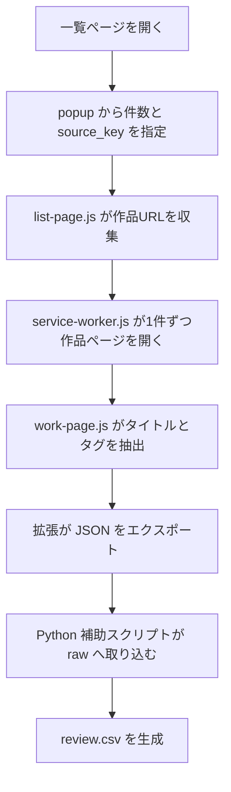

# Post Manager 実装前プラン
## Pixivタグ収集 Chrome拡張 最小構成

最終更新日: 2026-03-31  
関連文書:
- [pixiv-popular-tag-semi-auto-collection-diagnosis_20260331.md](/E:/codex/workspace/projects/post-manager-remake/docs/pixiv-popular-tag-semi-auto-collection-diagnosis_20260331.md)
- [pixiv-popular-tag-semi-auto-collection-implementation-plan_20260331.md](/E:/codex/workspace/projects/post-manager-remake/docs/pixiv-popular-tag-semi-auto-collection-implementation-plan_20260331.md)

## 1. 目的

Chrome拡張を使い、いま開いている Pixiv 一覧ページ上の画像サムネイル先にある作品ページから、少数件だけタグを取得して raw 原料へ回せる最小構成を整理する。

この段階では、seed への自動反映、learning への自動反映、大量巡回、無停止定期実行は行わない。

## 2. 要求の整理

- 依頼の本質  
  手動転記を減らしつつ、いま見ている一覧ページを起点に作品タグを少数件だけ収集したい。

- 重要な設計条件  
  取得は `明示実行` に限定し、対象件数を強く絞る。収集結果は `raw` 止まりにし、既存 suggest / seed / learning とは切り離す。

- 既存資産との境界  
  正本ロジックは [app](/E:/codex/workspace/projects/post-manager-remake/app) 側にあるが、拡張は本体ランタイムに混ぜず、別入口として扱う。  
  [pixiv_popular_tag_collection.py](/E:/codex/workspace/projects/post-manager-remake/app/src/pixiv_popular_tag_collection.py) は raw / review 整理だけを担い、拡張側は取得責務だけを持つ。

## 3. 推奨構成

### 推奨案

- Chrome拡張は `取得だけ`
- Python 補助スクリプトは `raw / review 整理だけ`
- 両者の受け渡しは、初回は `JSON エクスポート/インポート` にする

### この構成を推す理由

- 拡張からローカルファイルへ直接保存すると、権限、保存先、失敗時挙動の扱いが重くなりやすい
- まずは `JSON を書き出すだけ` にすれば、拡張側の責務を小さく保てる
- Python 側の既存 raw / review 方式をそのまま流用しやすい
- rollback が簡単

## 4. 最小ファイル構成

実装時の最小構成案は次。

- `app/chrome_extensions/pixiv-tag-collector/manifest.json`
- `app/chrome_extensions/pixiv-tag-collector/service-worker.js`
- `app/chrome_extensions/pixiv-tag-collector/list-page.js`
- `app/chrome_extensions/pixiv-tag-collector/work-page.js`
- `app/chrome_extensions/pixiv-tag-collector/popup.html`
- `app/chrome_extensions/pixiv-tag-collector/popup.js`
- `app/chrome_extensions/pixiv-tag-collector/README.md`

初回は CSS や複雑な UI を増やさず、popup と content script だけで完結する方が安全。

## 5. 各ファイルの役割

### `manifest.json`

- MV3 を前提にする
- 対象 URL を Pixiv ドメインに限定する
- 必要権限は最小限にする  
  例: `activeTab`, `scripting`, `tabs`, `downloads`

### `list-page.js`

- 一覧ページでサムネイル先の作品URLを収集する
- いまのページで見えている作品リンクだけを対象にする
- 上位 `5 / 10 / 20件` に絞れるようにする

### `work-page.js`

- 作品ページでタイトル、URL、タグ一覧を読む
- DOM 変更に弱い前提で、タグ取得失敗時は無理に続行せず `failed` として返す

### `service-worker.js`

- popup から開始指示を受ける
- URL を 1 件ずつ順に処理する
- 非アクティブタブで作品ページを開く
- 取得結果をメモリ上で集める
- 最後に JSON へまとめてダウンロードする

### `popup.html` / `popup.js`

- 実行ボタン
- 件数指定
- source_key 用の短いメモ入力
- 実行中表示
- 完了件数 / 失敗件数表示

### `README.md`

- 使い方
- 取得上限
- 出力例
- 失敗時の確認方法

## 6. データの流れ

## 7. 取得単位

- 起点  
  いま開いている一覧ページ 1 画面

- URL 抽出単位  
  一覧上の作品リンク

- 実作品取得単位  
  `1作品 = 1タグ集合`

- 初回上限  
  `5件`, `10件`, `20件` のいずれか

## 8. raw に渡す想定データ

初回の JSON エクスポート項目は次で十分。

- `version`
- `collected_at`
- `source_type`  
  値は `work`
- `source_key`  
  例: `r18-search-page-1`
- `page_url`  
  作品 URL
- `list_page_url`  
  一覧ページ URL
- `work_title`
- `tags`
- `status`  
  `success`, `failed`, `skipped`
- `note`

Python 側へ取り込むときは、既存 raw JSONL の形に寄せる。

## 9. 実装順

### Step 1. 拡張の責務を取得だけに固定する

- 対象  
  `docs`、`README`

- 確認すること  
  raw 保存や review 集約を拡張へ持ち込まない

- 戻し方  
  文書差分だけ戻す

### Step 2. 一覧ページから作品URLを集める

- 対象  
  `list-page.js`

- 確認すること  
  同一URL重複除去、上位件数制限、Pixiv 以外を拾わない

- 戻し方  
  `list-page.js` を外す

### Step 3. 作品ページからタグを読む

- 対象  
  `work-page.js`

- 確認すること  
  タグ未取得時に失敗として返せる、無限待ちしない

- 戻し方  
  `work-page.js` を外す

### Step 4. 逐次処理と待機を入れる

- 対象  
  `service-worker.js`

- 確認すること  
  1件ずつ処理する、同時多重取得しない、停止時に中途半端な残留タブを減らす

- 戻し方  
  `service-worker.js` を外す

### Step 5. popup から明示実行に限定する

- 対象  
  `popup.html`, `popup.js`

- 確認すること  
  引数なし自動実行をしない、件数上限を越えない

- 戻し方  
  popup を外す

### Step 6. JSON エクスポートまでで止める

- 対象  
  `service-worker.js`

- 確認すること  
  初回はローカル保存や API 接続をしない

- 戻し方  
  エクスポート機能を外す

## 10. 確認計画

- 正常系  
  一覧ページから 5 件取得して JSON エクスポートできる  
  各作品ページのタグが JSON に入る

- 失敗系  
  作品ページ取得失敗時に全体停止せず、`failed` として残せる  
  DOM 変更でタグが見つからないときに無限待ちしない

- 空入力  
  対象 URL が 0 件なら実行できない  
  source_key 空欄でも最低限の既定値を入れる

- 不正設定  
  Pixiv 以外のページで起動しても実行しない

- 存在しないパス  
  初回はローカル保存先を持たず、ダウンロードだけにするので該当なし

- 途中停止 / キャンセル  
  途中停止時に残る件数を表示する  
  開いたタブを極力閉じる

- 危険操作  
  一括大量取得ボタンを置かない  
  件数上限を UI で見えるようにする

- 長時間処理  
  20 件以上を初回では扱わない  
  同時実行を防ぐ

## 11. リスク

- Pixiv DOM 変更で取得ロジックが壊れやすい
- ログイン状態や表示条件でタグ DOM が変わる可能性がある
- 拡張から直接 raw 保存までやろうとすると責務が増えすぎる
- 件数制限が緩いと対策面と運用面のリスクが増える

## 12. 未決事項

- JSON エクスポートを手動ダウンロードにするか、クリップボードコピーも付けるか
- Python 側へ JSON import コマンドを追加するか
- 対象件数上限を `5 / 10 / 20` に固定するか、`10 / 20` だけに絞るか

## 13. 初回の推奨スコープ

- 一覧ページから上位 10 件の作品 URL を集める
- 作品ページからタグ取得
- JSON エクスポート
- 既存 raw / review とは手動インポートで接続

この段階では以下をやらない。

- 自動で raw JSONL に追記する
- review.csv を拡張内で作る
- seed / learning へ自動反映する
- 複数ページ巡回
- バックグラウンド定期実行

## 14. 戻し方

- `app/chrome_extensions/pixiv-tag-collector/` を外す
- docs に残した判断記録だけ参照用に残す
- Python 側の既存 raw / review 補助機能はそのまま維持する
